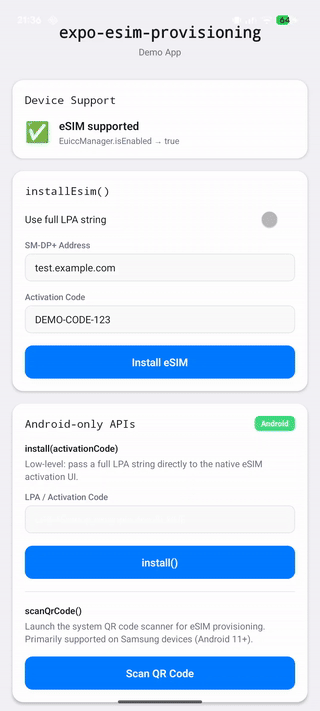

# expo-esim-provisioning

[](https://www.npmjs.com/package/expo-esim-provisioning)
[](https://github.com/DanielMarkiel/expo-esim-provisioning/actions/workflows/ci.yml)
[](https://github.com/DanielMarkiel/expo-esim-provisioning/blob/main/LICENSE)
[](https://github.com/DanielMarkiel/expo-esim-provisioning)

Cross-platform React Native & Expo module for eSIM provisioning on Android and iOS. Install eSIM profiles, scan QR
codes, and check device support — all from a single API.

## Features

- **`isEsimSupported()`** — Check device eSIM capability (Android: EuiccManager, iOS: version check)
- **`installEsim(data)`** — High-level cross-platform eSIM installation
- **`buildActivationString(data)`** — Build LPA strings from SM-DP+ address + activation code
- **`install(activationCode)`** — Low-level Android native eSIM activation
- **`scanQrCode()`** — Launch QR code scanner for eSIM provisioning (Samsung)
- **`EsimProvisioningError`** — Typed error class with machine-readable `code`

### Platform implementation

| Platform    | How it works                                                                                                                                                        |
| ----------- | ------------------------------------------------------------------------------------------------------------------------------------------------------------------- |
| **Android** | Native module using `EuiccManager` API (API 28+). Samsung-specific `ACTION_START_EUICC_ACTIVATION` on Android 11+. Includes AIDL `CarrierEuiccProvisioningService`. |
| **iOS**     | Apple Universal Link (`esimsetup.apple.com`) which presents the native eSIM setup modal. Requires iOS 17.4+. No restricted entitlements needed.                     |

## Demo

> **Note:** The demo uses test data and shows the error flow, as real eSIM installation requires activation codes from
> an eSIM provider. See the [Testing](#testing) section for information on obtaining real test credentials.

<div align="center">

### iOS - Installation Flow (Error Handling)


_Demo shows: ✓ Device support check → ✓ Native eSIM modal opens → ✓ Error handling with typed errors_

### Android - Installation Flow (Error Handling)



_Demo shows: ✓ Device support check → ✓ System eSIM dialog opens → ✓ Error handling with typed errors_

</div>

**What the demo demonstrates:**

- ✅ `isEsimSupported()` device capability detection
- ✅ Native eSIM UI integration (iOS Universal Link / Android Intent)
- ✅ Typed error handling with `EsimProvisioningError`
- ✅ Loading states and user feedback
- ⚠️ Installation fails with test data (expected — see [Testing](#testing) for real credentials)

## Requirements

| Requirement  | Minimum  |
| ------------ | -------- |
| Android API  | 28 (Pie) |
| iOS          | 17.4+    |
| Expo SDK     | 51+      |
| React Native | 0.74+    |

> **Note:** eSIM functionality requires a physical device with eSIM hardware. Simulators and emulators do not support
> eSIM.

## Installation

```sh
npx expo install expo-esim-provisioning
```

## Quick start

```typescript
import { isEsimSupported, installEsim, EsimProvisioningError } from 'expo-esim-provisioning';

// 1. Check device support
if (!isEsimSupported()) {
  console.log('eSIM not supported — show QR code or manual instructions');
  return;
}

// 2. Install eSIM profile
try {
  await installEsim({
    smdpAddress: 'smdp.example.com',
    activationCode: 'ABC-XYZ-123',
  });
  console.log('eSIM installation triggered');
} catch (error) {
  if (error instanceof EsimProvisioningError) {
    switch (error.code) {
      case 'USER_CANCELED':
        // user dismissed the system UI
        break;
      case 'UNSUPPORTED':
        // device doesn't support eSIM
        break;
      case 'INSTALL_FAILED':
        // native installation failed — show manual instructions
        break;
      case 'LINK_FAILED':
        // iOS Universal Link couldn't open
        break;
      case 'NO_DATA':
        // missing activation data
        break;
    }
  }
}
```

### Using a full LPA string

```typescript
await installEsim({
  lpaString: 'LPA:1$smdp.example.com$ACTIVATION_CODE',
});
```

### iOS-specific: detecting return from eSIM setup

On iOS, `installEsim` opens the system eSIM modal via a Universal Link. The app goes to background. Use `AppState` to
detect when the user returns:

```typescript
import { AppState } from 'react-native';
import { installEsim } from 'expo-esim-provisioning';

await installEsim({ lpaString: '...' });

// Listen for app returning to foreground
const subscription = AppState.addEventListener('change', (state) => {
  if (state === 'active') {
    // Re-check eSIM status from your backend
    subscription.remove();
  }
});
```

## API Reference

### `isEsimSupported(): boolean`

Returns `true` if the device supports eSIM provisioning.

- **Android:** Checks `EuiccManager.isEnabled` (requires API 28+, physical eUICC chip).
- **iOS:** Returns `true` on iOS 17.4+ (Universal Link approach).
- **Other:** Returns `false`.

### `installEsim(data: EsimProvisioningData): Promise<string>`

High-level, cross-platform eSIM installation.

**Parameters:**

```typescript
type EsimProvisioningData = {
  lpaString?: string | null; // Full LPA string (takes precedence)
  smdpAddress?: string | null; // SM-DP+ server address
  activationCode?: string | null; // Activation code / matching ID
};
```

Provide **either** `lpaString` **or** both `smdpAddress` + `activationCode`.

**Throws** `EsimProvisioningError` with one of these codes:

| Code             | Platform | Description                              |
| ---------------- | -------- | ---------------------------------------- |
| `NO_DATA`        | Both     | Activation data is missing or incomplete |
| `UNSUPPORTED`    | Both     | Device/OS doesn't support eSIM           |
| `USER_CANCELED`  | Android  | User dismissed the activation UI         |
| `INSTALL_FAILED` | Android  | Native installation failed               |
| `LINK_FAILED`    | iOS      | Universal Link couldn't be opened        |

### `buildActivationString(data: EsimProvisioningData): string | null`

Utility to build an LPA activation string from structured data.

```typescript
buildActivationString({ smdpAddress: 'smdp.example.com', activationCode: 'ABC' });
// → "LPA:1$smdp.example.com$ABC"
```

### `install(activationCode: string): Promise<string>` _(Android only)_

Low-level: launch the Android system eSIM activation UI directly with an LPA string. For most use-cases, prefer
`installEsim()`.

### `scanQrCode(): Promise<string>` _(Android only)_

Launch the system QR code scanner for eSIM provisioning. Primarily supported on Samsung devices (Android 11+).

### `EsimProvisioningError`

Error class with a `code` property for programmatic handling:

```typescript
class EsimProvisioningError extends Error {
  readonly code: EsimProvisioningErrorCode;
}
```

## How it works

### Android activation flow

1. The activation code is stored in `CarrierEuiccProvisioningService` (an Android bound service)
2. A system intent launches the device's eSIM manager UI
3. The system binds to `CarrierEuiccProvisioningService` to retrieve the activation code via AIDL
4. The user confirms the eSIM installation in the system UI
5. The promise resolves or rejects based on the activity result

Samsung devices (Android 11+) use `EuiccManager.ACTION_START_EUICC_ACTIVATION` for a more reliable experience. Other
devices use a generic `ACTION_VIEW` intent with the LPA URI.

### iOS Universal Link flow

1. An Apple Universal Link is opened: `https://esimsetup.apple.com/esim_qrcode_provisioning?carddata=<LPA_STRING>`
2. iOS presents the native eSIM installation modal
3. The app goes to background while the user completes setup
4. The app returns to foreground — use `AppState` to detect this and re-check status

This approach works on iOS 17.4+ without the restricted `CTCellularPlanProvisioning` entitlement.

### `isEsimSupported` explained

**Android:** Checks `EuiccManager.isEnabled`, which returns `true` when the device has eSIM hardware (eUICC chip), the
chip is enabled, and the system LPA is available. This checks hardware capability, not whether a profile is installed.

**iOS:** Checks the OS version (≥ 17.4). Hardware detection is not possible without the restricted entitlement, but
virtually all iPhones since iPhone XS (2018) have eSIM support, so the version check is a reasonable proxy.

## Testing

### Using real eSIM profiles

To test actual eSIM installation (not just the error flow), you need real activation codes from an eSIM provider.

**eSIM providers with developer/test programs:**

- **[Truphone](https://www.truphone.com/developer/)** — Developer program with test eSIM profiles
- **[Airalo](https://www.airalo.com/)** — Purchase inexpensive data plans ($3-5) for testing
- **[1Global](https://www.1global.com/)** — eSIM API and developer access
- **[GigSky](https://www.gigsky.com/)** — Developer partnerships available

### What you can test without real credentials

```typescript
import { isEsimSupported, buildActivationString } from 'expo-esim-provisioning';

// ✅ Always works — checks device capability
const isSupported = isEsimSupported();
console.log('eSIM supported:', isSupported);

// ✅ Always works — builds LPA string from any data
const lpa = buildActivationString({
  smdpAddress: 'test.example.com',
  activationCode: 'TEST-123',
});
console.log('LPA string:', lpa); // "LPA:1$test.example.com$TEST-123"

// ⚠️ Opens native UI but will fail without real activation code
await installEsim({
  smdpAddress: 'test.example.com',
  activationCode: 'TEST-123',
});
// → Throws EsimProvisioningError with code 'INSTALL_FAILED'
```

### Testing the UI flow with test data

Even with invalid credentials, you can verify:

1. **Device support detection** — `isEsimSupported()` returns correct value
2. **Native UI integration** — System eSIM modal/dialog opens correctly
3. **Error handling** — `EsimProvisioningError` is thrown with the correct `code`
4. **Loading states** — UI shows loading indicators during async operations
5. **Platform differences** — iOS Universal Link vs Android Intent behavior

This is sufficient for developing the UI/UX of your app before obtaining real eSIM credentials.

### Example with QR code (Android)

If you have a physical QR code from an eSIM provider:

```typescript
import { scanQrCode, installEsim } from 'expo-esim-provisioning';

// Scan QR code to get LPA string
const lpaString = await scanQrCode();

// Use scanned data for installation
await installEsim({ lpaString });
```

> **Supported devices:** QR scanning primarily works on Samsung devices (Android 11+) using
> `ACTION_START_EUICC_ACTIVATION`.

## Acknowledgements

Inspired by [expo-esim](https://github.com/Al-Taie/expo-esim) by Ahmed Al-Taie. This module extends the original with
cross-platform support (iOS Universal Links), `isEsimSupported()` device capability detection, a structured error class,
and a high-level `installEsim()` API.

## Contributing & Releasing

### Making a change

1. Create a branch, make your changes, then run:

   ```sh
   npx changeset
   ```

   Choose `patch` / `minor` / `major` and describe the change. Commit the generated `.changeset/*.md` file with your PR.

2. Open a PR — CI will run lint, build, and type-check automatically.

### Publishing a release

After a PR with a changeset is merged to `main`, the **Changesets bot** opens (or updates) a **"Version Packages"** pull
request that bumps `package.json` and updates `CHANGELOG.md`.

Merging that PR triggers the release workflow which:

- Publishes the package to [npm](https://www.npmjs.com/package/expo-esim-provisioning)
- Creates a GitHub Release with auto-generated notes

> **Required secret:** add `NPM_TOKEN` (Automation token from npmjs.com) to the repo's GitHub Actions secrets.

## License

MIT
